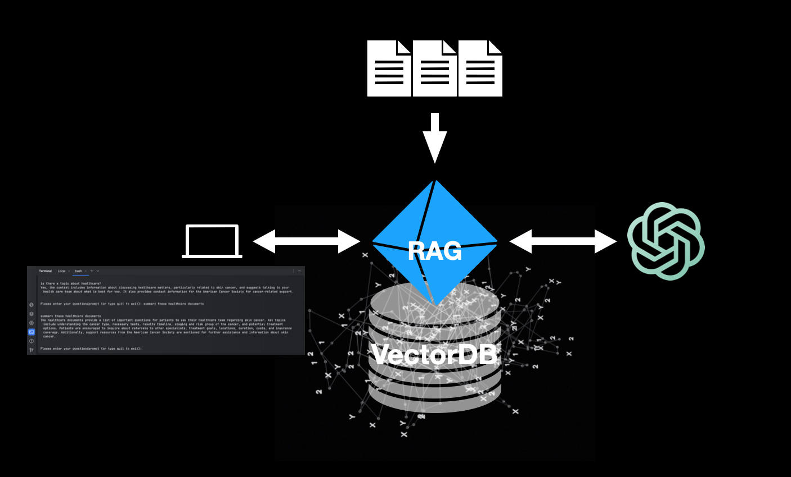
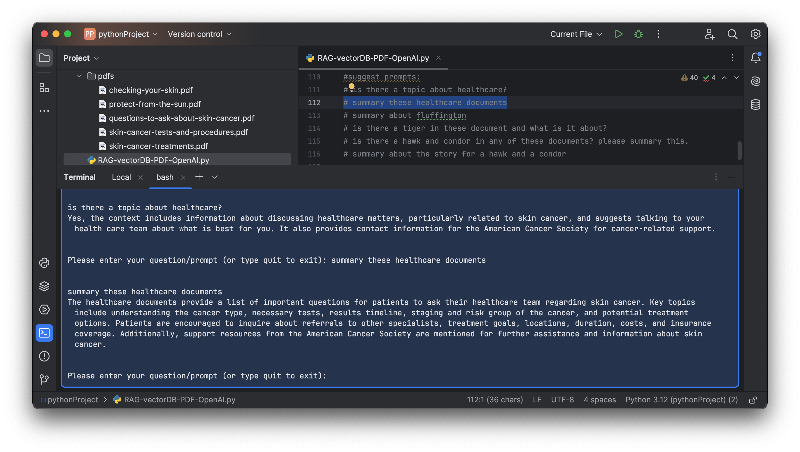
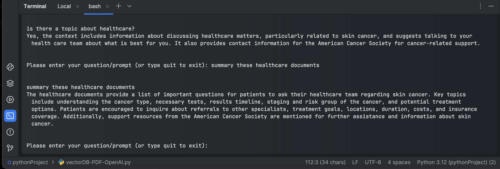
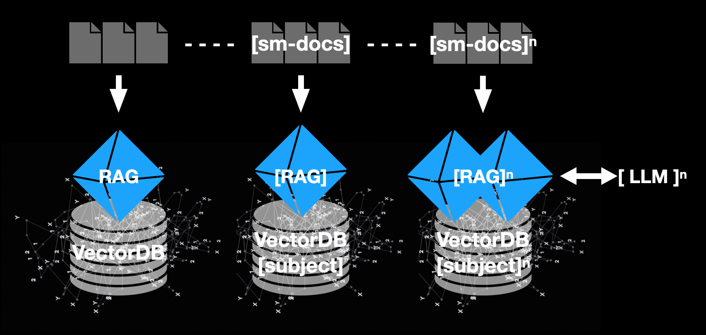

# Harnessing RAG and VectorDB to Generate Relevant PDF Responses with OpenAI

- Dare to dream
- Ignite your inspiration and innovation
- Strive for excellence
- Explore together & unlock the world's knowledge

This POC demonstrates a system that harnesses Retrieval-Augmented Generation (RAG) and VectorDB (ChromaDB) to generate relevant responses from PDF documents using OpenAI's advanced language models. By integrating the document retrieval efficiency of VectorDB with the robust response generation of RAG, this system provides an innovative solution for extracting and interpreting information from PDFs or Text documents. The POC outlines the system's architecture, implementation, and preliminary performance, showcasing its capability to produce accurate and contextually appropriate responses. 

This approach has the potential to transform automated document processing and information retrieval, making it an ideal solution for AI-Enhanced Peer Review application.

--------------------------------------

## 

- enhancing and expanding the n-solution (in progress...)

